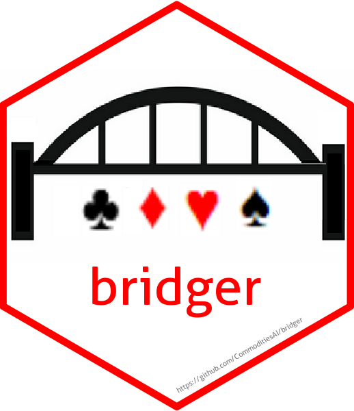

# bridger


<!-- badges: start -->

[](https://cran.r-project.org/package=bridger)
[](https://github.com/tidyverse/bridger/actions?workflow=R-CMD-check)
<!-- badges: end -->

## Overview
Generate  hands for playing bridge or as an aid to  practicing and teaching.

Base system is Benjimised Acol with a weak 1 notrump, but parameters can be amended to allow different conventions to be adapted by setting point ranges and suit lengths.

Outputs are in the form of PDFs with up to six hands per page. The outputs can be customised to show all or a subset of seat. Additional data, such as high-card point count and suit length points are included for those hands shown. An indication of losing trick count (either the original system or the modified system) can also be added.

## Installation

``` r
# The easiest way to get dplyr is to install the whole tidyverse:
install.packages("bridger")

```

## Functions to be added

1) Allow vulnerability to factor into the hand selection,
2) Extend additional parameters, e.g. response by partner to an opening bid, or overcall by opponents

## Usage

```r
# To generate a page of 6 opening hands, showing all seats:

    printHands(handType = "opener", num = 6, output = "FULL")

# To generate a page of hands likely to open a pre-emptive at the 3-level, showing only the opener - standardised as South

    printHands(handType = "preempt3", num = 6, output = "S")
    
# To generate a single hand likely to open a pre-emptive at the 3-level, showing only the opener and their partner

    printHands(handType = "preempt3", num = 1, output = "SN")

```
